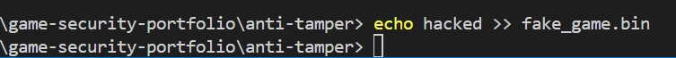
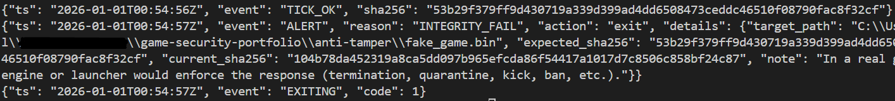

# Anti-Tamper Lite – Proof of Concept

## Overview

This repository contains a lightweight client-side anti-tamper Proof of Concept.
It implements a small set of defensive checks commonly found in games and launchers,
with an emphasis on clarity and reproducibility rather than stealth or resistance.

The objective is to demonstrate how basic integrity and environment checks can be
implemented and wired together in a clean and auditable way.

---

## Features

- File integrity verification using SHA-256 hashing
- Runtime detection of forbidden tools (process name, executable path, command line)
- Basic anti-debugging check using the Windows API (`IsDebuggerPresent`)
- Structured JSON logging for detections and state changes
- Configuration-driven behavior via YAML

---

## Scope and Design Choices

This PoC intentionally stays **userland and client-side only**:

- No kernel components
- No code obfuscation or packing
- No server-side validation or enforcement
- No attempt to hide or protect the detection logic itself

These constraints are deliberate. The goal is to focus on detection logic,
configuration, and expected behavior rather than on bypass resistance.

---

## Usage

```bash
pip install -r requirements.txt
python anti_tamper.py
```

---

## Notes

This module represents a detection component only.

When a violation is detected, the script logs a structured security event and
terminates according to the configured policy. In a real game architecture,
this component would report to the engine, launcher, or backend, which would
be responsible for enforcement decisions (session termination, kick, flagging,
ban, etc.).

---

## Example: Integrity Violation Detection

Below is an example showing how the anti-tamper reacts when the monitored file
is modified at runtime.

1. The script is running and periodically checking file integrity.
2. The target file is modified externally.
3. An integrity violation is detected and logged.
4. The process exits according to the configured policy.

### Simulated tampering (external modification)



### Integrity violation triggered



- **Event: TICK_OK** = Anti-tamper running in normal state

- **Event: ALERT** = Integrity violation detected