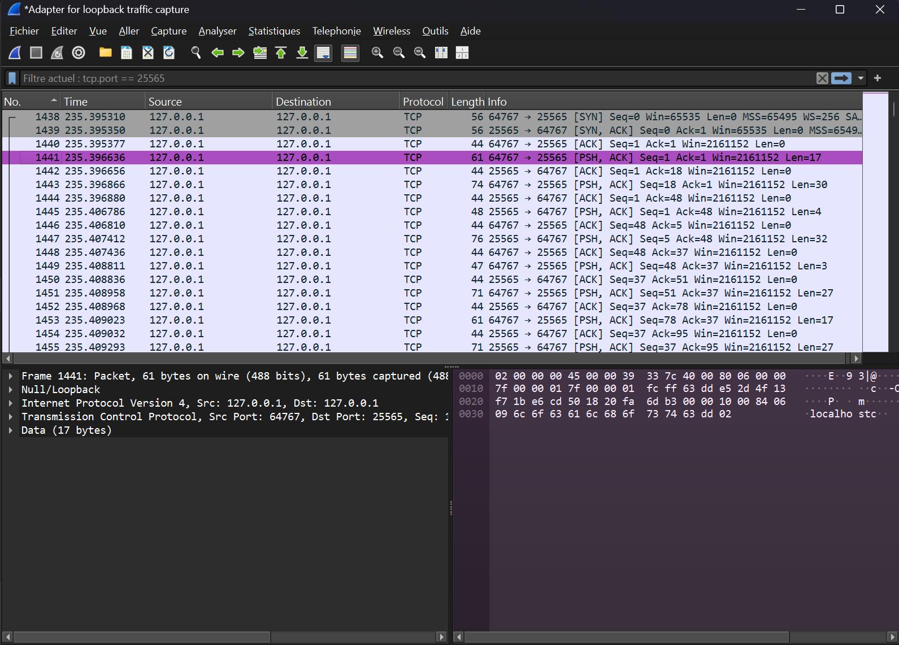
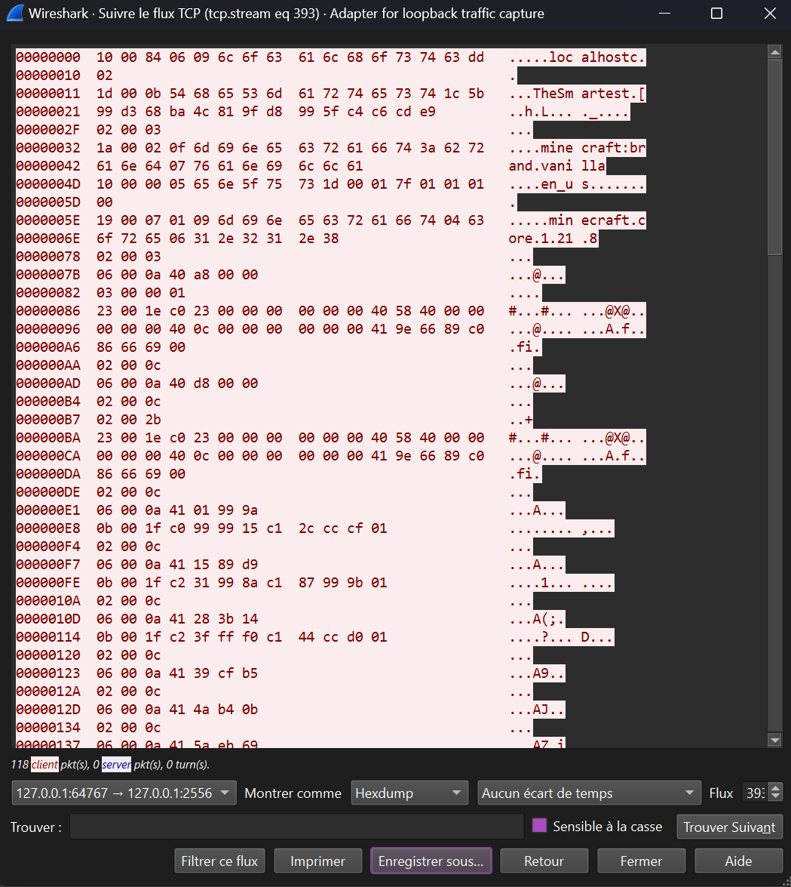

# Network Analysis – Minecraft Loopback Traffic

## Overview

This project documents a local network traffic analysis performed against a
Minecraft server running on the loopback interface.

The goal is to demonstrate a practical methodology for observing, extracting,
and understanding client-server communication at the TCP and application layers,
using standard tooling such as Wireshark.

This is an analysis-oriented project, not an exploitation or bypass attempt.

---

## Scope

- Local traffic capture on `127.0.0.1`
- TCP session inspection and stream reconstruction
- Application-layer payload visibility analysis
- Payload replay experiments in a controlled environment

Out of scope:
- Protocol exploitation
- Authentication bypass
- Server-side manipulation
- Kernel-level or anti-cheat evasion techniques

---

## Capture Setup

- Tool: Wireshark
- Interface: Loopback
- Protocol: TCP
- Target port: Minecraft server port (25565)

The capture focuses on the client-to-server connection established when joining
a locally hosted Minecraft server.

---

## Analysis Example

### Loopback Traffic Capture

This screenshot shows the TCP packets exchanged between the Minecraft client
and the local server over the loopback interface.

---

### TCP Stream Inspection

Using Wireshark’s *Follow TCP Stream* feature, the application-layer payload can
be reconstructed and inspected in hexadecimal form.

Readable metadata and structured binary data are visible within the stream,
illustrating what information is exposed at this stage of the connection.

---

## Scripts

Two small Python scripts were written to support the analysis and experimentation:

- **`minecraft_tcp_payload_sender.py`**  
  Sends a raw TCP payload to a local Minecraft server endpoint.  
  Used to generate or replay traffic during analysis.

- **`replay_from_hexdump.py`**  
  Extracts hexadecimal byte sequences from a Wireshark hexdump export and
  reconstructs the corresponding binary payload for replay.

These scripts are intentionally minimal and focus on reproducibility rather than
protocol correctness.

---

## Notes

- All traffic was generated and captured locally against a server under full control.
- This project focuses on methodology and visibility, not attack effectiveness.
- The analysis illustrates the limits of passive network inspection in a
  client-server game context.

