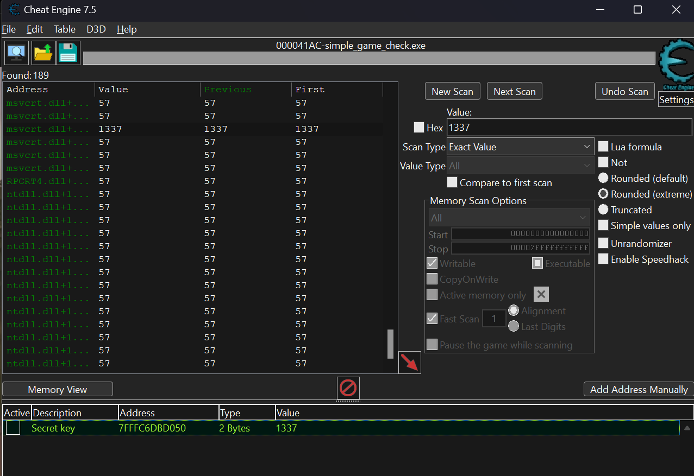

# Dynamic Analysis

## Process Observation
The binary was executed and attached to **Cheat Engine 7.5**. The goal was to monitor how the validation key is handled in RAM while the program awaits user input.

## Discovery Methodology
Since the static analysis showed that strings were compressed, the secret key could not be identified offline. 
**Scenario:** To identify the validation logic, I performed a memory scan during the input prompt, searching for common "Leet" patterns and constant integers often used as placeholders in simple check routines.

## Memory Inspection
- **Target Value:** 1337
- **Tool used:** Cheat Engine
- **Scanning Strategy:** Initial scans for "4-byte" integers yielded no results. Switching the value type to **"All"** allowed for a successful identification of the key.

*Figure 2: Identification of the 1337 value within the process memory.*

## Findings
- **Discovery:** The value `1337` was located at memory address `7FFFC6DBD050`.
- **Data Type:** Contrary to standard 4-byte integer expectations, the value is stored as a **2-byte integer** (Short) in this specific process.

## Conclusion
The secret key is stored in plain text (unencrypted) within the process memory. This confirms that the application lacks basic memory protection or obfuscation, allowing a user to easily identify the correct response via a simple memory scan.