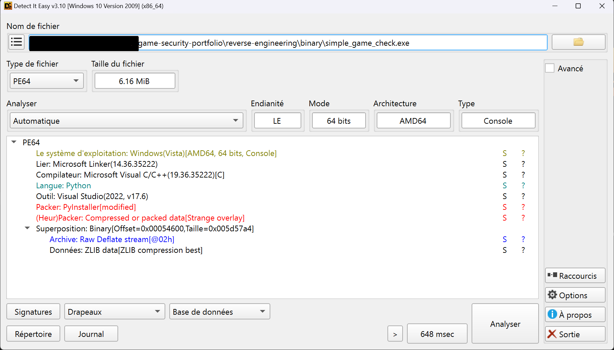

# Static Analysis

## Overview
The analyzed binary is a small Windows executable built from Python and packaged using PyInstaller. Its primary function is to perform a simple environment or integrity check.

## File Information
- **Platform:** Windows
- **Architecture:** x64
- **Language:** Python
- **Packaging:** PyInstaller

## Static Inspection (Detect It Easy)
Using **Detect It Easy (DIE)**, the binary was confirmed to be a PE64 file. The tool successfully identified the Python runtime and the PyInstaller packer used to bundle the script.

*Figure 1: DIE overview identifying the PyInstaller packer and Python language.*

## Strings Analysis
Initial inspection reveals standard PyInstaller metadata and runtime loader references. However, application-specific logic (such as the "Access granted" message) is not immediately visible. This is because the code is stored within the **Superposition (Overlay)** section as ZLIB-compressed data. No suspicious URLs or network indicators were found during this stage.

## Initial Hypothesis
The program likely performs a basic runtime validation. Since the core logic is compressed within the overlay, static analysis provides limited insight into the specific comparison values. Dynamic analysis is required to observe the program's behavior and identify the validation key in memory.